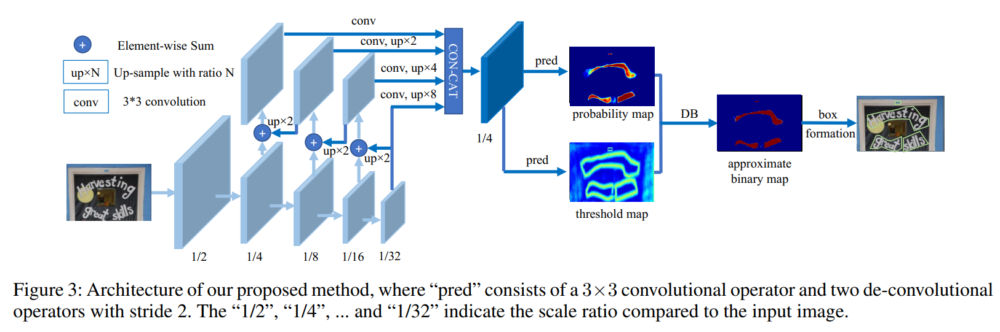

# Real-time Scene Text Detection with Differentiable Binarization

**note**: some code is inherited from [MhLiao/DB](https://github.com/MhLiao/DB)

[中文解读](https://zhuanlan.zhihu.com/p/94677957)





## Install Using Conda
```
conda env create -f environment.yml
git clone https://github.com/WenmuZhou/DBNet.pytorch.git
cd DBNet.pytorch/
```

or
## Install Manually 
```bash
conda create -n dbnet python=3.6
conda activate dbnet

conda install ipython pip

# python dependencies
pip install -r requirement.txt

# install PyTorch with cuda-10.1
# Note that you can change the cudatoolkit version to the version you want.
# Also note that torchvision >=0.5 requires Pytorch >=1.4 which is not yet released
# so you need to install nightly version.
conda install pytorch torchvision cudatoolkit=10.1 -c pytorch-nightly

# clone repo
git clone https://github.com/WenmuZhou/DBNet.pytorch.git
cd DBNet.pytorch/

```

## Requirements
* pytorch 1.4 so you better install pytorch-nightly
* torchvision 0.5+
* gcc 4.9+

## Download

TBD

## Data Preparation

Training data: prepare a text `train.txt` in the following format, use '\t' as a separator
```
./datasets/train/img/001.jpg	./datasets/train/gt/001.txt
```

Validation data: prepare a text `test.txt` in the following format, use '\t' as a separator
```
./datasets/test/img/001.jpg	./datasets/test/gt/001.txt
```
- Store images in the `img` folder
- Store groundtruth in the `gt` folder

The groundtruth can be `.txt` files, with the following format:
```
x1, y1, x2, y2, x3, y3, x4, y4, annotation
```


## Train
1. config the `dataset['train']['dataset'['data_path']'`,`dataset['validate']['dataset'['data_path']`in [config/icdar2015_resnet18_fpn_DBhead_polyLR.yaml](cconfig/icdar2015_resnet18_fpn_DBhead_polyLR.yaml)
* . single gpu train
```bash
bash singlel_gpu_train.sh
```
* . Multi-gpu training
```bash
bash multi_gpu_train.sh
```
## Test

[eval.py](tools/eval.py) is used to test model on test dataset

1. config `model_path` in [eval.sh](eval.sh)
2. use following script to test
```bash
bash eval.sh
```

## Predict 
[predict.py](tools/predict.py) is used to inference on single image
1. config `model_path`,`img_path` in [eval.sh](eval.sh)
2. use following script to predict
```
bash predict.sh
```
You can change the `model_path` in the `/tools/predict.py` file to your model location. 

The project is still under development.

<h2 id="Performance">Performance</h2>

### [ICDAR 2015](http://rrc.cvc.uab.es/?ch=4)
only train on ICDAR2015 dataset

| Method                   | image size (short size) |learning rate | Precision (%) | Recall (%) | F-measure (%) | FPS |
|:--------------------------:|:-------:|:--------:|:--------:|:------------:|:---------------:|:-----:|
| SynthText-Defrom-ResNet-18(paper)  | 736 |0.007 | 86.8 | 78.4 | 82.3 | 48 |
| ImageNet-Resnet18-FPN-DBHead  |736 |1e-3| 87.03 | 75.06 | 80.6 | 43 |
| ImageNet-Defrom-Resnet18-FPN-DBHead  |736 |1e-3| 88.61 | 73.84 | 80.56 | 36 |
| ImageNet-Resnet50-FPN-DBHead  |736 |1e-3| 88.06 | 77.14 | 82.24 | 27 |


### examples
TBD


### todo
- [x] mutil gpu training

### reference
1. https://arxiv.org/pdf/1911.08947.pdf
2. https://github.com/WenmuZhou/PANet.pytorch
3. https://github.com/MhLiao/DB

**If this repository helps you，please star it. Thanks.**
